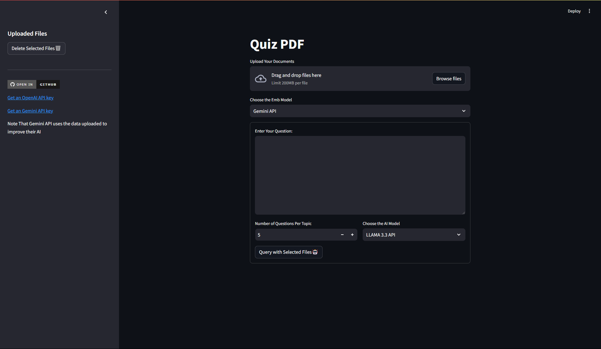

# Quiz PDF 🏫

Welcome to the Quiz PDF project! This project allows you to upload PDF documents, process them, and generate quiz questions using AI models. The application is built using Streamlit and integrates with various AI models for document processing and question generation.

## Features ✨

- Upload multiple PDF documents
- Process and split documents into chunks
- Store document chunks in a Chroma database
- Generate quiz questions using AI models
- Download generated quiz questions

## Getting Started 🚀

### Prerequisites

Make sure you have the following installed:

- Python 3.8 or higher
- pip (Python package installer)

### Installation

1. **Clone the repository:**

    ```sh
    git clone https://github.com/Shift118/AI-QuizPDF.git
    cd AI-QuizPDF
    ```

2. **Create a virtual environment:**

    ```sh
    python -m venv venv
    ```

3. **Activate the virtual environment:**

    - On Windows:

        ```sh
        venv\Scripts\activate.bat
        ```

    - On macOS/Linux:

        ```sh
        source venv/bin/activate
        ```

4. **Install the required packages:**

    ```sh
    pip install -r requirements.txt
    ```

### Configuration

1. **API Keys:**

    - Rename the [.streamlit-rem](http://_vscodecontentref_/1)  tofolder [.streamlit](http://_vscodecontentref_/2).
    - Open the [secrets.toml](http://_vscodecontentref_/3) file and enter your API keys:

        ```toml
        [APIs]
        GITHUB_TOKEN=""
        GEMINI_API_KEY=""
        ```

### Running the Application

1. **Start the Streamlit app:**

    ```sh
    streamlit run main.py
    ```

2. **Open your web browser and navigate to:**

    ```
    http://localhost:8501
    ```

## How It Works 🛠️

1. **Upload Documents:**

    - Use the file uploader to upload your PDF documents.
    - The uploaded files will be stored in the `data/Documents` folder.

2. **Process Documents:**

    - The documents are loaded and split into chunks.
    - The chunks are added to the Chroma database for efficient retrieval.

3. **Generate Quiz Questions:**

    - Enter your query and select the AI model.
    - The query should be the topic names which you want to generate questions about.
    - The application uses Retrieval-Augmented Generation (RAG) to generate quiz questions based on the selected documents.

4. **Download Quiz Questions:**

    - Once the questions are generated, you can download them as a text file.

## Screenshot 📸



## Contributing 🤝

Contributions are welcome! Please fork the repository and submit a pull request.

## License 📜

This project is licensed under a custom license. You are free to use, modify, and distribute this project for personal and educational purposes. For commercial use, please contact the author.

---

Happy Quizzing! 🎉